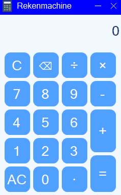

# SunnyCalc

A clean and modern calculator application built using **C# WinForms** and **SunnyUI**.
SunnyCalc supports basic arithmetic operations and features a simple interface.

## 🎥 Demo




## ✨ Features

- Modern UI using **SunnyUI** components
- Supports:
  - Addition `+`
  - Subtraction `-`
  - Multiplication `×`
  - Division `÷`
- Live expression display (e.g., `5+5`)
- Safe input (prevents invalid expressions like `++` or `--`)
- AC (clear all) and C (clear last number) functionality
- Backspace button `⌫`
- Custom window title design
- Clean and responsive layout

## 🛠 Technologies Used

- **C#**
- **WinForms**
- **SunnyUI** (NuGet package)
- **.NET Framework / .NET version used in project**

## 📦 How to Build

1. Clone the repository:
   ```
   git clone https://github.com/FaulinV/SunnyCalc.git
   ```
2. Open the solution in **Visual Studio 2022**
3. Restore NuGet packages (happens automatically)
4. Build the project in **Release** mode
5. The executable will be created in:
   ```
   /bin/Release/
   ```

## 📘 About

This project was created for educational purposes and practice in C# WinForms UI development.

## 🧑‍💻 Author

**Zhan Kornilov (Faulin)** 
